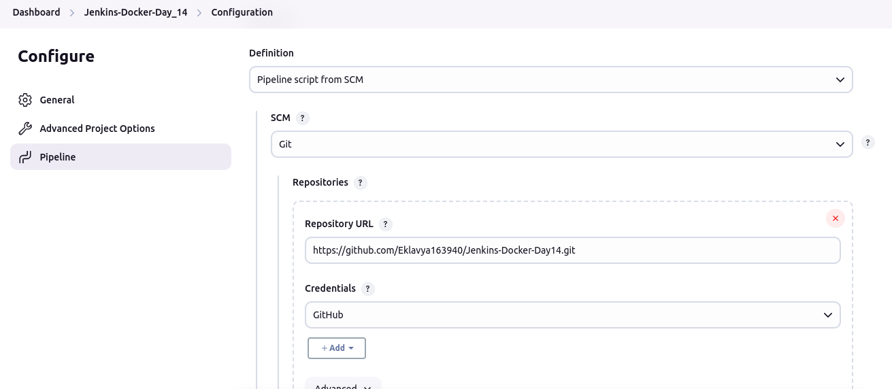
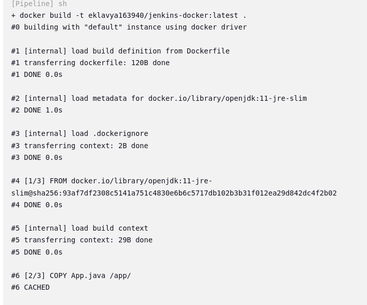
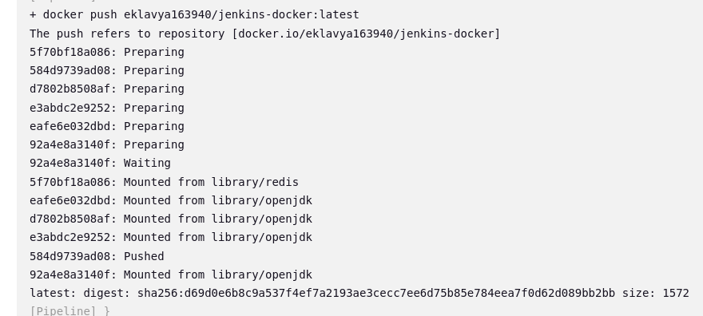

# Jenkins-Docker-Day14

## Project 01

### Problem Statement:
You are tasked with setting up a CI/CD pipeline using Jenkins to streamline the deployment process of a simple Java application. The pipeline should accomplish the following tasks:

- Fetch the Dockerfile: The pipeline should clone a GitHub repository containing the source code of the Java application and a Dockerfile.


- Create a Docker Image: The pipeline should build a Docker image from the fetched Dockerfile.

### Dockerfile
```
FROM openjdk:11-jre-slim
COPY App.java /app/
WORKDIR /app
CMD ["java", "App.java"]
```



### Jenkinsfile
```
pipeline{

    agent any

    environment{
        dockerImage = ''
        registry = 'eklavya163940/jenkins-docker'
        registryCredentials = 'dockerhub-credentials'
    }

    stages{
        stage('Build Docker Image'){
            steps{
                script{
                    dockerImage = docker.build("${registry}:${env.BUILD_ID}")
                }
            }
        }
        stage('Push Docker Image'){
            steps{
                script{
                    docker.withRegistry('', registryCredentials){
                        dockerImage.push()
                    }
                }
            }
        }
        stage('Deploy Container'){
            steps{
                script{
                    docker.withRegistry('', registryCredentials){
                        def runContainer = docker.image("${registry}:${env.BUILD_ID}").run('--name mynew-container -d')
                        echo "Container ID: ${runContainer.id}"
                    }
                }
            }
        }
    }
}
```

- Push the Docker Image: The pipeline should push the created Docker image to a specified DockerHub repository.



