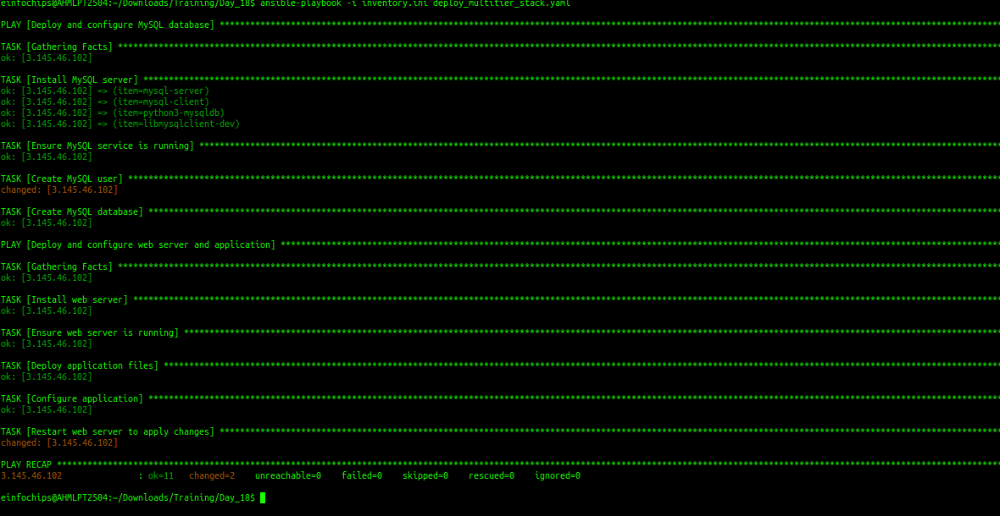

# Project 2

#### Objective: 

+ ***Automate the setup of a multi-tier web application stack with separate database and application servers using Ansible.***

### Problem Statement

### Objective: 

***Automate the deployment and configuration of a multi-tier web application stack consisting of:***

1. Database Server: Set up a MySQL database server on one Ubuntu instance.

2. Application Server: Set up a web server (e.g., Apache or Nginx) on another Ubuntu instance to host a web application.

3. Application Deployment: Ensure the web application is deployed on the application server and is configured to connect to the MySQL database on the database server.

4. Configuration Management: Use Ansible to automate the configuration of both servers, including the initialization of the database and the deployment of the web application.

### Deliverables

1. Ansible Inventory File
        
    + Filename: inventory.ini
        
    + Content: Defines the database server and application server instances, including their IP addresses and connection details.


```ini
[dbserver]
target1 ansible_host=3.145.46.1xx ansible_user=ubuntu ansible_ssh_private_key_file= ~/.ssh/your_key.pem

[apserver]
target2 ansible_host=3.145.46.1xx ansible_user=ubuntu ansible_ssh_private_key_file= ~/.ssh/your_key.pem
```
+ To verify we will ping both the server using following ad-hoc command 

```sh
ansible all -i inventory.ini -m ping
```


2. Ansible Playbook
    
    + Filename: "deploy_multitier_stack.yml"
    
    + Content: 
    
        + Automates:

        + The deployment and configuration of the MySQL database server.
        
```yml
- name: Deploy and configure MySQL database
  hosts: dbserver
  become: yes
  vars:
    db_name: "my_database"
    db_user: "my_user"
    db_password: "user123"

  tasks:
  - name: Install MySQL server
    apt:
      update_cache: yes
      name: "{{ item }}"
      state: present
    with_items:
    - mysql-server
    - mysql-client
    - python3-mysqldb
    - libmysqlclient-dev

  - name: Ensure MySQL service is running
    service:
      name: mysql
      state: started
      enabled: yes

  - name: Create MySQL user
    mysql_user:
      name: "{{ db_user }}"
      password: "{{ db_password }}"
      priv: '*.*:ALL'
      host: '%'
      state: present

  - name: Create MySQL database
    mysql_db:
      name: "{{ db_name }}"
      state: present

- name: Deploy and configure web server and application
  hosts: apserver
  become: yes

  vars:
    db_host: "host_ip"
    db_name: "my_database"
    db_user: "my_user"
    db_password: "user123"

  tasks:
  - name: Install web server
    apt:
      name: nginx
      state: present
      update_cache: yes

  - name: Ensure web server is running
    service:
      name: nginx
      state: started
      enabled: yes

  - name: Deploy application files
    copy:
      src: files/index.html
      dest: /var/www/html/index.html

  - name: Configure application
    template:
      src: templates/app_config.php.j2
      dest: /var/www/html/app_config.php

  - name: Restart web server to apply changes
    service:
      name: nginx
      state: restarted
```

3. Jinja2 Template

    + Filename: templates/app_config.php.j2
    
    + Content: Defines a configuration file for the web application that includes placeholders for dynamic values such as database connection details.

```j2
<?php
$servername = "{{ db_host }}";
$username = "{{ db_user }}";
$password = "{{ db_password }}";
$dbname = "{{ db_name }}";

// to create the connection

$conn = new mysqli($servername, $username, $password, $dbname);

// to check the connection

if ($conn->connect_error) {
    die("Connection failed: " . $conn->connect_error);
}
echo "Connected successfully";
?>
```




 Application Files
    
    + Filename: files/index.html (or equivalent application files)
    
    + Content: Static or basic dynamic content served by the web application.

```html
<!DOCTYPE html>
<html lang="en">
<head>
    <meta charset="UTF-8">
    <meta name="viewport" content="width=device-width, initial-scale=1.0">
    <title>My Web Application</title>
</head>
<body>
    <h1>Welcome to My Web Application</h1>
    <p>This application is connected to a MySQL database.</p>
</body>
</html>
```
