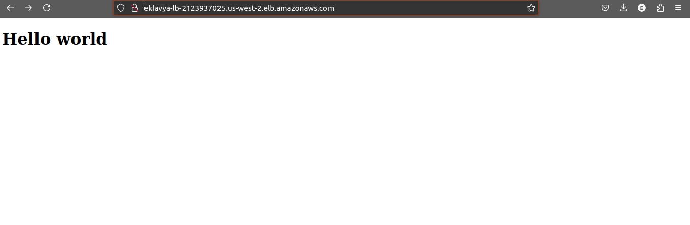
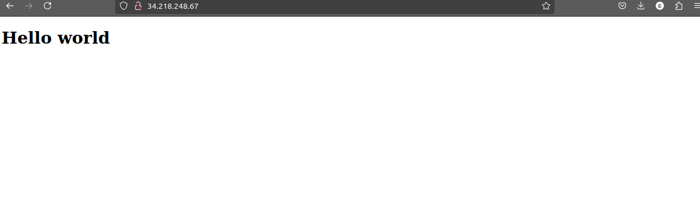
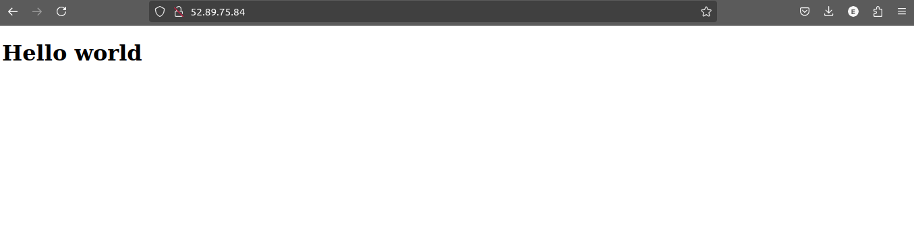

# Comprehensive AWS S3 Management and Static Website Hosting

## Objective

This project is designed to test and enhance your knowledge and skills in managing AWS S3 storage classes, lifecycle management, bucket policies, access control lists (ACLs), and hosting a static website on S3. The goal is to ensure that you have mastered the critical aspects of AWS S3 through practical application.

## Project Scenario

You are tasked with creating and managing an S3 bucket for a fictional company, **TechVista Inc.**, which hosts a static website to display their product portfolio. The website includes various types of content, such as high-resolution images/images, which require effective storage management to optimize costs. Additionally, the company mandates strict security requirements for accessing the content.

## Project Steps and Deliverables

### 1. Create and Configure an S3 Bucket
- **Create an S3 bucket** named `techvista-portfolio-[your-initials]`.
- **Enable versioning** on the bucket to maintain object versions.
- **Set up static website hosting** on the bucket.
- **Upload the provided static website files** (HTML, CSS, images/images).
- **Ensure accessibility** of the website via the S3 website URL.

`index.html` file
```html
<!DOCTYPE html>
<html lang="en">
<head>
    <meta charset="UTF-8">
    <meta name="viewport" content="width=device-width, initial-scale=1.0">
    <title>Document</title>
    <link rel="stylesheet" href="styles.css">
</head>
<body>
    <h1>Hello World!</h1>
</body>
</html>
```






