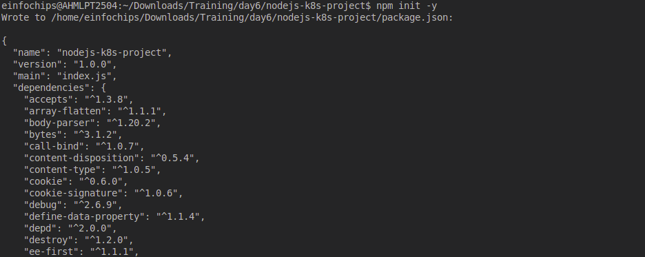
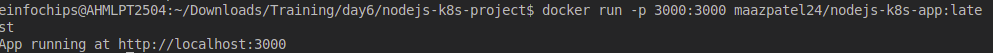
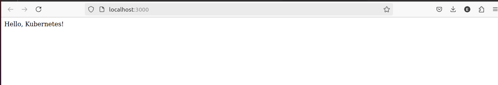
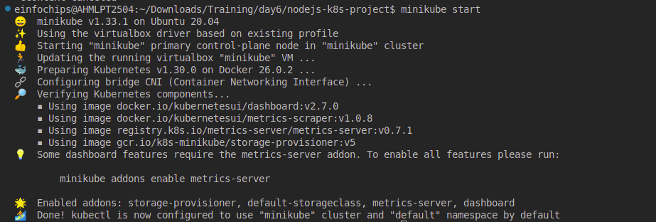
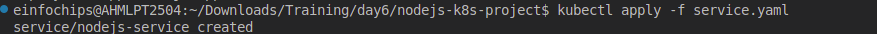
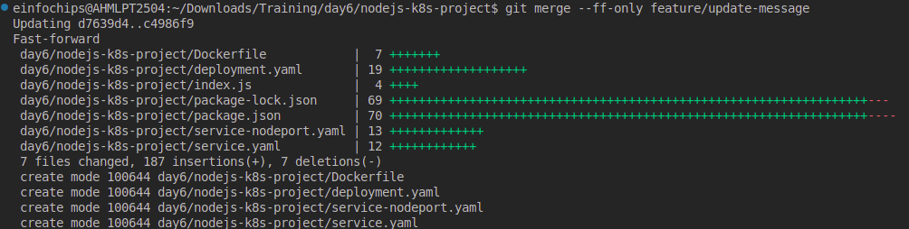
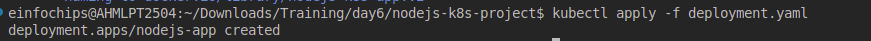
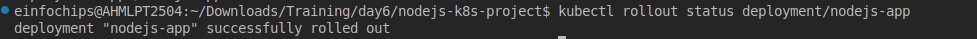
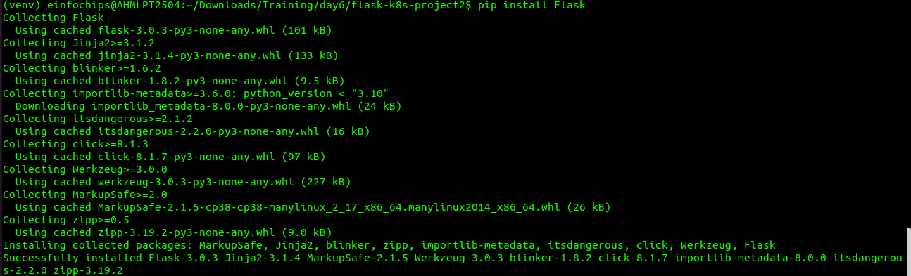
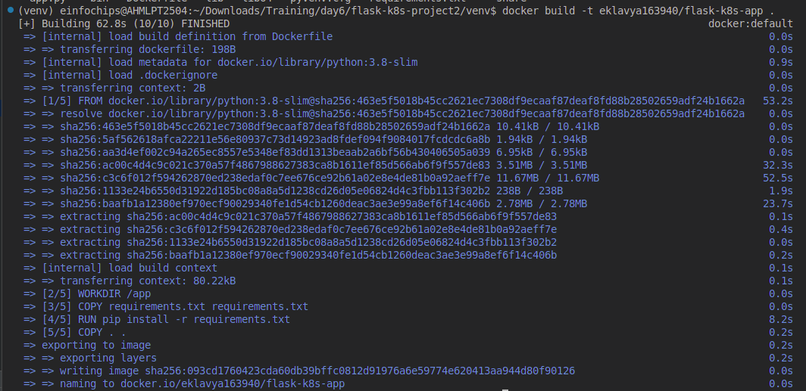

###
### **Project 01**
### **Deploying a Node.js App Using Minikube Kubernetes**
#### **Overview**
This project guides you through deploying a Node.js application using Minikube Kubernetes. You'll use Git for version control, explore branching and fast-forward merges, and set up Kubernetes services and deployment pods, including ClusterIP and NodePort service types.
#### **Prerequisites**
- Minikube installed
- kubectl installed
- Git installed
- Node.js installed (<https://nodejs.org/en/download/package-manager/all#debian-and-ubuntu-based-linux-distributions>)
#### **Project Steps**
### **1. Set Up Git Version Control**
**1.1. Initialize a Git Repository**

Create a new directory for your project:

mkdir nodejs-k8s-project

cd nodejs-k8s-project

Initialize a Git repository:

git init

**1.2. Create a Node.js Application**

Initialize a Node.js project:

npm init -y

Install Express.js:

npm install express

Create an index.js file with the following content:

const express = require('express');

const app = express();

const port = 3000;

app.get('/', (req, res) => {

`    `res.send('Hello, Kubernetes!');

});

app.listen(port, () => {

`    `console.log(`App running at http://localhost:${port}`);

});

Create a .gitignore file to ignore node\_modules:

node\_modules

**1.3. Commit the Initial Code**

Add files to Git:

git add .

Commit the changes:

git commit -m "Initial commit with Node.js app"

### **2. Branching and Fast-Forward Merge**
**2.1. Create a New Branch**

Create and switch to a new branch feature/add-route:

git checkout -b feature/add-route

**2.2. Implement a New Route**

Modify index.js to add a new route:

app.get('/newroute', (req, res) => {

`    `res.send('This is a new route!');

});

Commit the changes:

git add .

git commit -m "Add new route"

**2.3. Merge the Branch Using Fast-Forward**

Switch back to the main branch:

git checkout main

Merge the feature/add-route branch using fast-forward:

git merge --ff-only feature/add-route

Delete the feature branch:

git branch -d feature/add-route
### **3. Containerize the Node.js Application**
**3.1. Create a Dockerfile**

Create a Dockerfile with the following content:

FROM node:14

WORKDIR /app

COPY package\*.json ./

RUN npm install

COPY . .

EXPOSE 3000

CMD ["node", "index.js"]

**3.2. Build and Test the Docker Image**

Build the Docker image:

docker build -t nodejs-k8s-app .

Run the Docker container to test:

docker run -p 3000:3000 nodejs-k8s-app

1. Access http://localhost:3000 to see the app running.

### **4. Deploying to Minikube Kubernetes**
**4.1. Start Minikube**

Start Minikube:

minikube start

**4.2. Create Kubernetes Deployment and Service Manifests**

Create a deployment.yaml file:

apiVersion: apps/v1

kind: Deployment

metadata:

`  `name: nodejs-app

spec:

`  `replicas: 2

`  `selector:

`    `matchLabels:

`      `app: nodejs-app

`  `template:

`    `metadata:

`      `labels:

`        `app: nodejs-app

`    `spec:

`      `containers:

`      `- name: nodejs-app

`        `image: nodejs-k8s-app:latest

`        `ports:

`        `- containerPort: 3000

Create a service.yaml file for ClusterIP:

apiVersion: v1

kind: Service

metadata:

`  `name: nodejs-service

spec:

`  `selector:

`    `app: nodejs-app

`  `ports:

`  `- protocol: TCP

`    `port: 80

`    `targetPort: 3000

`  `type: ClusterIP

Create a service-nodeport.yaml file for NodePort:

apiVersion: v1

kind: Service

metadata:

`  `name: nodejs-service-nodeport

spec:

`  `selector:

`    `app: nodejs-app

`  `ports:

`  `- protocol: TCP

`    `port: 80

`    `targetPort: 3000

`    `nodePort: 30001

`  `type: NodePort

**4.3. Apply Manifests to Minikube**

Apply the deployment:

kubectl apply -f deployment.yaml

Apply the ClusterIP service:

kubectl apply -f service.yaml

Apply the NodePort service:

kubectl apply -f service-nodeport.yaml

**4.4. Access the Application**

Get the Minikube IP:

minikube ip

1. Access the application using the NodePort:

   curl http://<minikube-ip>:30001

### **Making Changes to the App and Redeploying Using Kubernetes**
### **6. Making Changes to the Node.js Application**
**6.1. Create a New Branch for Changes**

Create and switch to a new branch feature/update-message:

git checkout -b feature/update-message

**6.2. Update the Application**

Modify index.js to change the message:

const express = require('express');

const app = express();

const port = 3000;

app.get('/', (req, res) => {

`    `res.send('Hello, Kubernetes! Updated version.');

});

app.get('/newroute', (req, res) => {

`    `res.send('This is a new route!');

});

app.listen(port, () => {

`    `console.log(`App running at http://localhost:${port}`);

});

**6.3. Commit the Changes**

Add and commit the changes:

git add .

git commit -m "Update main route message"

### **7. Merge the Changes and Rebuild the Docker Image**
**7.1. Merge the Feature Branch**

Switch back to the main branch:

git checkout main

Merge the feature/update-message branch:

git merge --ff-only feature/update-message

Delete the feature branch:

git branch -d feature/update-message

**7.2. Rebuild the Docker Image**

Rebuild the Docker image with a new tag:

docker build -t nodejs-k8s-app:v2 .

### **8. Update Kubernetes Deployment**
**8.1. Update the Deployment Manifest**

Modify deployment.yaml to use the new image version:

apiVersion: apps/v1

kind: Deployment

metadata:

`  `name: nodejs-app

spec:

`  `replicas: 2

`  `selector:

`    `matchLabels:

`      `app: nodejs-app

`  `template:

`    `metadata:

`      `labels:

`        `app: nodejs-app

`    `spec:

`      `containers:

`      `- name: nodejs-app

`        `image: nodejs-k8s-app:v2

`        `ports:

`        `- containerPort: 3000

**8.2. Apply the Updated Manifest**

Apply the updated deployment:

kubectl apply -f deployment.yaml

**8.3. Verify the Update**

Check the status of the deployment:

kubectl rollout status deployment/nodejs-app

### **9. Access the Updated Application**
**9.1. Access Through ClusterIP Service**

Forward the port to access the ClusterIP service:

kubectl port-forward service/nodejs-service 8080:80

1. Open your browser and navigate to http://localhost:8080 to see the updated message.

**9.2. Access Through NodePort Service**

1. Access the application using the NodePort:

   curl http://<minikube-ip>:30001

**Project 02** 
### **Deploying a Python Flask App Using Minikube Kubernetes**
#### **Overview**
This project guides you through deploying a Python Flask application using Minikube Kubernetes. You'll use Git for version control, explore branching and fast-forward merges, and set up Kubernetes services and deployment pods, including ClusterIP and NodePort service types.
#### **Prerequisites**
- Minikube installed
- kubectl installed
- Git installed
- Python installed
#### **Project Steps**
### **1. Set Up Git Version Control**
**1.1. Initialize a Git Repository**

Create a new directory for your project:

mkdir flask-k8s-project

cd flask-k8s-project

Initialize a Git repository:
sh
Copy code
git init

**1.2. Create a Python Flask Application**

Create a virtual environment:

python -m venv venv

source venv/bin/activate

Install Flask:
sh
Copy code
pip install Flask

Create an app.py file with the following content:
python
Copy code
from flask import Flask

app = Flask(\_\_name\_\_)

@app.route('/')

def hello\_world():

`    `return 'Hello, Kubernetes!'

if \_\_name\_\_ == '\_\_main\_\_':

`    `app.run(host='0.0.0.0', port=5000)

Create a requirements.txt file to list the dependencies:
Copy code
Flask

Create a .gitignore file to ignore venv:
Copy code
venv

**1.3. Commit the Initial Code**

Add files to Git:

git add .

Commit the changes:

git commit -m "Initial commit with Flask app"

### **2. Branching and Fast-Forward Merge**
**2.1. Create a New Branch**

Create and switch to a new branch feature/add-route:

git checkout -b feature/add-route

**2.2. Implement a New Route**

Modify app.py to add a new route:

@app.route('/newroute')

def new\_route():

`    `return 'This is a new route!'

Commit the changes:

git add .

git commit -m "Add new route"

**2.3. Merge the Branch Using Fast-Forward**

Switch back to the main branch:

git checkout main

Merge the feature/add-route branch using fast-forward:

git merge --ff-only feature/add-route

Delete the feature branch:

git branch -d feature/add-route

### **3. Containerize the Flask Application**
**3.1. Create a Dockerfile**

Create a Dockerfile with the following content:

FROM python:3.8-slim

WORKDIR /app

COPY requirements.txt requirements.txt

RUN pip install -r requirements.txt

COPY . .

EXPOSE 5000

CMD ["python", "app.py"]

**3.2. Build and Test the Docker Image**

Build the Docker image:

docker build -t flask-k8s-app .

Run the Docker container to test:

docker run -p 5000:5000 flask-k8s-app

1. Access http://localhost:5000 to see the app running.
### **4. Deploying to Minikube Kubernetes**
**4.1. Start Minikube**

Start Minikube:

minikube start

**4.2. Create Kubernetes Deployment and Service Manifests**

Create a deployment.yaml file:

apiVersion: apps/v1

kind: Deployment

metadata:

`  `name: flask-app

spec:

`  `replicas: 2

`  `selector:

`    `matchLabels:

`      `app: flask-app

`  `template:

`    `metadata:

`      `labels:

`        `app: flask-app

`    `spec:

`      `containers:

`      `- name: flask-app

`        `image: flask-k8s-app:latest

`        `ports:

`        `- containerPort: 5000

Create a service.yaml file for ClusterIP:

apiVersion: v1

kind: Service

metadata:

`  `name: flask-service

spec:

`  `selector:

`    `app: flask-app

`  `ports:

`  `- protocol: TCP

`    `port: 80

`    `targetPort: 5000

`  `type: ClusterIP

Create a service-nodeport.yaml file for NodePort:

apiVersion: v1

kind: Service

metadata:

`  `name: flask-service-nodeport

spec:

`  `selector:

`    `app: flask-app

`  `ports:

`  `- protocol: TCP

`    `port: 80

`    `targetPort: 5000

`    `nodePort: 30001

`  `type: NodePort

**4.3. Apply Manifests to Minikube**

Apply the deployment:

kubectl apply -f deployment.yaml

Apply the ClusterIP service:

kubectl apply -f service.yaml

Apply the NodePort service:

kubectl apply -f service-nodeport.yaml

**4.4. Access the Application**

Get the Minikube IP:

minikube ip

Access the application using the NodePort:

curl http://<minikube-ip>:30001

### **5. Clean Up**
Stop Minikube:

minikube stop

Delete Minikube cluster:

minikube delete

### **6. Making Changes to the Flask Application**
**6.1. Create a New Branch for Changes**

Create and switch to a new branch feature/update-message:

git checkout -b feature/update-message

**6.2. Update the Application**

Modify app.py to change the message:

@app.route('/')

def hello\_world():

`    `return 'Hello, Kubernetes! Updated version.'

@app.route('/newroute')

def new\_route():

`    `return 'This is a new route!'

**6.3. Commit the Changes**

Add and commit the changes:

git add .

git commit -m "Update main route message"

### **7. Merge the Changes and Rebuild the Docker Image**
**7.1. Merge the Feature Branch**

Switch back to the main branch:

git checkout main

Merge the feature/update-message branch:

git merge --ff-only feature/update-message

Delete the feature branch:

git branch -d feature/update-message

**7.2. Rebuild the Docker Image**

Rebuild the Docker image with a new tag:

docker build -t flask-k8s-app:v2 .

### **8. Update Kubernetes Deployment**
**8.1. Update the Deployment Manifest**

Modify deployment.yaml to use the new image version:

apiVersion: apps/v1

kind: Deployment

metadata:

`  `name: flask-app

spec:

`  `replicas: 2

`  `selector:

`    `matchLabels:

`      `app: flask-app

`  `template:

`    `metadata:

`      `labels:

`        `app: flask-app

`    `spec:

`      `containers:

`      `- name: flask-app

`        `image: flask-k8s-app:v2

`        `ports:

`        `- containerPort: 5000

**8.2. Apply the Updated Manifest**

Apply the updated deployment:
sh
Copy code
kubectl apply -f deployment.yaml

**8.3. Verify the Update**

Check the status of the deployment:
sh
Copy code
kubectl rollout status deployment/flask-app
### **9. Access the Updated Application**
**9.1. Access Through ClusterIP Service**

Forward the port to access the ClusterIP service:

kubectl port-forward service/flask-service 8080:80

1. Open your browser and navigate to http://localhost:8080 to see the updated message.

**9.2. Access Through NodePort Service**

1. Access the application using the NodePort:

   curl http://<minikube-ip>:30001

