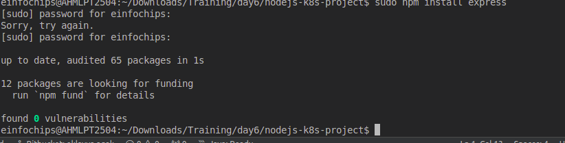

### **Project 01**

### **Deploying a Node.js App Using Minikube Kubernetes**

#### **Overview**

This project guides you through deploying a Node.js application using Minikube Kubernetes. You'll use Git for version control, explore branching and fast-forward merges, and set up Kubernetes services and deployment pods, including ClusterIP and NodePort service types.

#### **Prerequisites**

* Minikube installed  
* kubectl installed  
* Git installed  
* Node.js installed ([https://nodejs.org/en/download/package-manager/all\#debian-and-ubuntu-based-linux-distributions](https://nodejs.org/en/download/package-manager/all\#debian-and-ubuntu-based-linux-distributions))

#### **Project Steps**

### **1\. Set Up Git Version Control**

**1.1. Initialize a Git Repository**

Create a new directory for your project:

`mkdir nodejs-k8s-project`

`cd nodejs-k8s-project`

Initialize a Git repository:

`git init`

**1.2. Create a Node.js Application**

Initialize a Node.js project:

`npm init -y`


Install Express.js:


Create an `index.js` file with the following content:
```
const express = require('express');
const app = express();
const port = 3000;

app.get('/', (req, res) => {
    res.send('Hello, Kubernetes!');
});

app.listen(port, () => {
    console.log(`App running at http://localhost:${port}`);
});
```
