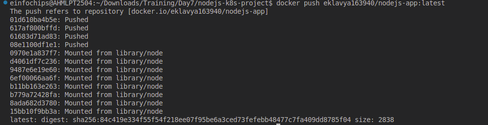
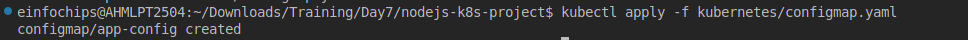

####
**Project 01**


In this project, you will develop a simple Node.js application, deploy it on a local Kubernetes cluster using Minikube, and configure various Kubernetes features. The project includes Git version control practices, creating and managing branches, and performing rebases. Additionally, you will work with ConfigMaps, Secrets, environment variables, and set up vertical and horizontal pod autoscaling.
## <a name="_5w1o0y5kgeee"></a>**Project 01**
## <a name="_o8l9cqx5ntwe"></a>**Project Steps**
### <a name="_wmhiyxmdw008"></a>**1. Setup Minikube and Git Repository**

**Start Minikube**:

minikube start
#### <a name="_753kaziyz2kp"></a>**1.2 Set Up Git Repository**
**Create a new directory for your project**:

mkdir nodejs-k8s-project

cd nodejs-k8s-project

**Initialize Git repository**:

git init

**Create a .gitignore file**:

node\_modules/

.env

**Add and commit initial changes**:

git add .

git commit -m "Initial commit"

### <a name="_agam96qgx2ow"></a>**2. Develop a Node.js Application**
#### <a name="_j6x9hh6odqai"></a>**2.1 Create the Node.js App**
**Initialize the Node.js project**:

npm init -y


**Install necessary packages**:

npm install express body-parser


Create `app.js`:
```javascript
const express = require('express');
const bodyParser = require('body-parser');
const app = express();
const PORT = process.env.PORT || 3000;

app.use(bodyParser.json());

app.get('/', (req, res) => {
  res.send('Hello, World!');
});

app.listen(PORT, () => {
  console.log(`Server is running on port ${PORT}`);
});
```


Update `package.json` to include a start script:
```json
"scripts": {
  "start": "node app.js"
}
```

#### <a name="_cv05tu9scd20"></a>**2.2 Commit the Node.js Application**
**Add and commit changes**:

git add .

git commit -m "Add Node.js application code"

### <a name="_tii3mvd1bko9"></a>**3. Create Dockerfile and Docker Compose**
#### <a name="_i39r92qry0mk"></a>**3.1 Create a Dockerfile**
**Add Dockerfile**:

Add `Dockerfile`:
```Dockerfile
# Use official Node.js image
FROM node:18

# Set the working directory
WORKDIR /usr/src/app

# Copy package.json and package-lock.json
COPY package*.json ./

# Install dependencies
RUN npm install

# Copy the rest of the application code
COPY . .

# Expose the port on which the app runs
EXPOSE 3000

# Command to run the application
CMD [ "npm", "start" ]
```

**Create a .dockerignore file**:

node\_modules

.npm
#### <a name="_ihjkdpgnel8s"></a>**3.2 Create docker-compose.yml (optional for local testing)**
**Add docker-compose.yml**:

```yaml
version: '3'
services:
  app:
    build: .
    ports:
      - "3000:3000"
```

**Add and commit changes**:

git add Dockerfile docker-compose.yml

git commit -m "Add Dockerfile and Docker Compose configuration"

### <a name="_vqtrdt917dke"></a>**4. Build and Push Docker Image**
#### <a name="_7n1b12bk5rkt"></a>**4.1 Build Docker Image**
**Build the Docker image**:

docker build -t nodejs-app:latest .


#### <a name="_wwp4bglbxe6q"></a>**4.2 Push Docker Image to Docker Hub**
**Tag and push the image**:

docker tag nodejs-app:latest your-dockerhub-username/nodejs-app:latest

docker push your-dockerhub-username/nodejs-app:latest



**Add and commit changes**:

git add .

git commit -m "Build and push Docker image"

### <a name="_f90u2bvyuuaj"></a>**5. Create Kubernetes Configurations**
#### <a name="_8mq8hb2zb5pl"></a>**5.1 Create Kubernetes Deployment**
**Create kubernetes/deployment.yaml**:


```yaml
apiVersion: apps/v1
kind: Deployment
metadata:
  name: nodejs-app-deployment
spec:
  replicas: 2
  selector:
    matchLabels:
      app: nodejs-app
  template:
    metadata:
      labels:
        app: nodejs-app
    spec:
      containers:
      - name: nodejs-app
        image: your-dockerhub-username/nodejs-app:latest
        ports:
        - containerPort: 3000
        env:
        - name: PORT
          valueFrom:
            configMapKeyRef:
              name: app-config
              key: PORT
        - name: NODE_ENV
          valueFrom:
            secretKeyRef:
              name: app-secrets
              key: NODE_ENV
```


#### <a name="_64upslle4d4b"></a>**5.2 Create ConfigMap and Secret**
**Create kubernetes/configmap.yaml**:

```yaml
apiVersion: v1
kind: ConfigMap
metadata:
  name: app-config
data:
  PORT: "3000"
```

**Create kubernetes/secret.yaml**:

```yaml
apiVersion: v1
kind: Secret
metadata:
  name: app-secrets
type: Opaque
data:
  NODE_ENV: cHJvZHVjdGlvbmFs # Base64 encoded value for "production"
```

**Add and commit Kubernetes configurations**:

git add kubernetes/

git commit -m "Add Kubernetes deployment, configmap, and secret"

#### <a name="_atnc5g9x5l29"></a>**5.3 Apply Kubernetes Configurations**
**Apply the ConfigMap and Secret**:

kubectl apply -f kubernetes/configmap.yaml



kubectl apply -f kubernetes/secret.yaml


**Apply the Deployment**:

kubectl apply -f kubernetes/deployment.yaml


### <a name="_4h5pphrw9w12"></a>**6. Implement Autoscaling**
#### <a name="_yqu6af6rp6do"></a>**6.1 Create Horizontal Pod Autoscaler**
**Create kubernetes/hpa.yaml**:

```yaml
apiVersion: autoscaling/v2beta2
kind: HorizontalPodAutoscaler
metadata:
  name: nodejs-app-hpa
spec:
  scaleTargetRef:
    apiVersion: apps/v1
    kind: Deployment
    name: nodejs-app-deployment
  minReplicas: 2
  maxReplicas: 5
  metrics:
  - type: Resource
    resource:
      name: cpu
      target:
        type: Utilization
        averageUtilization: 50
```

**Apply the HPA**:

kubectl apply -f kubernetes/hpa.yaml


#### <a name="_9gh7fo4a7ayk"></a>**6.2 Create Vertical Pod Autoscaler**
**Create kubernetes/vpa.yaml**:

apiVersion: autoscaling.k8s.io/v1beta2

kind: VerticalPodAutoscaler

metadata:

`  `name: nodejs-app-vpa

spec:

`  `targetRef:

`    `apiVersion: apps/v1

`    `kind: Deployment

`    `name: nodejs-app-deployment

`  `updatePolicy:

`    `updateMode: "Auto"

**Apply the VPA**:

kubectl apply -f kubernetes/vpa.yaml

### <a name="_5v86s28fz07c"></a>**7. Test the Deployment**
#### <a name="_dgzvl53j9qh9"></a>**7.1 Check the Status of Pods, Services, and HPA**
**Verify the Pods**:

kubectl get pods

**Verify the Services**:

kubectl get svc


**Verify the HPA**:

kubectl get hpa


#### <a name="_wm91vod3ucqf"></a>**7.2 Access the Application**
**Expose the Service**:

kubectl expose deployment nodejs-app-deployment --type=NodePort –name=nodejs-app-service


**Get the Minikube IP and Service Port**:

minikube service nodejs-app-service –url


- **Access the Application** in your browser using the URL obtained from the previous command.
### <a name="_p3upnd1za7cl"></a>**8. Git Version Control**
#### <a name="_60qffzdsg5n9"></a>**8.1 Create a New Branch for New Features**
**Create and switch to a new branch**:

git checkout -b feature/new-feature

**Make changes and commit**:

\# Make some changes

git add .

git commit -m "Add new feature"

**Push the branch to the remote repository**:

git push origin feature/new-feature

#### <a name="_u9dpoyz7fu5l"></a>**8.2 Rebase Feature Branch on Main Branch**
**Switch to the main branch and pull the latest changes**:

git checkout main

git pull origin main

**Rebase the feature branch**:

git checkout feature/new-feature

git rebase main

**Resolve conflicts if any, and continue the rebase**:

git add .

git rebase --continue

**Push the rebased feature branch**:

git push origin feature/new-feature --force

### <a name="_tzpzhsxz7asq"></a>**9. Final Commit and Cleanup**
**Merge feature branch to main**:

git checkout main

git merge feature/new-feature

**Push the changes to the main branch**:

git push origin main

**Clean up**:

git branch -d feature/new-feature

git push origin --delete feature/new-feature


**Project 02**

Deploy a Node.js application to Kubernetes with advanced usage of ConfigMaps and Secrets. Implement Horizontal Pod Autoscaler (HPA) with both scale-up and scale-down policies. The project will include a multi-environment configuration strategy, integrating a Redis cache, and monitoring application metrics.
## <a name="_vxos5xaqk977"></a>**Project Setup**
### <a name="_fwdw7oyvv0c5"></a>**1.1 Initialize a Git Repository**
Create a new directory for your project and initialize Git:

mkdir nodejs-advanced-k8s-project

cd nodejs-advanced-k8s-project

git init

### <a name="_8ysy9fmlje87"></a>**1.2 Create Initial Files**
Create the initial Node.js application and Docker-related files:

npm init -y

npm install express redis body-parser

#### <a name="_64um16vblaq"></a>**app.js**

const express = require('express');

const bodyParser = require('body-parser');

const redis = require('redis');

const app = express();

const PORT = process.env.PORT || 3000;

// Connect to Redis

const redisClient = redis.createClient({

`  `url: `redis://${process.env.REDIS\_HOST}:${process.env.REDIS\_PORT}`

});

redisClient.on('error', (err) => console.error('Redis Client Error', err));

app.use(bodyParser.json());

app.get('/', async (req, res) => {

`  `const visits = await redisClient.get('visits');

`  `if (visits) {

`    `await redisClient.set('visits', parseInt(visits) + 1);

`  `} else {

`    `await redisClient.set('visits', 1);

`  `}

`  `res.send(`Hello, World! You are visitor number ${visits || 1}`);

});

app.listen(PORT, () => {

`  `console.log(`Server is running on port ${PORT}`);

});

#### <a name="_d1ohjp7vceaq"></a>**Dockerfile**

FROM node:18

WORKDIR /usr/src/app

COPY package\*.json ./

RUN npm install

COPY . .

EXPOSE 3000

CMD ["npm", "start"]

#### <a name="_j1gsoihkvomg"></a>**.dockerignore**

node\_modules

.npm


**1. Build and push Docker image:**

`   `docker build -t your-dockerhub-username/nodejs-advanced-app:latest .

`   `docker push your-dockerhub-username/nodejs-advanced-app:latest


Apply Kubernetes configurations:

kubectl apply -f kubernetes/


Access the application:

minikube service nodejs-advanced-app-service --url


**2. Advanced Kubernetes Configuration**

**2.1 Deployment Configuration**

Create `kubernetes/deployment.yaml` to deploy the Node.js application with Redis dependency:

\```yaml

apiVersion: apps/v1

kind: Deployment

metadata:

`  `name: nodejs-advanced-app-deployment

spec:

`  `replicas: 2

`  `selector:

`    `matchLabels:

`      `app: nodejs-advanced-app

`  `template:

`    `metadata:

`      `labels:

`        `app: nodejs-advanced-app

`    `spec:

`      `containers:

`      `- name: nodejs-advanced-app

`        `image: your-dockerhub-username/nodejs-advanced-app:latest

`        `ports:

`        `- containerPort: 3000

`        `env:

`        `- name: PORT

`          `valueFrom:

`            `configMapKeyRef:

`              `name: app-config

`              `key: PORT

`        `- name: REDIS\_HOST

`          `valueFrom:

`            `configMapKeyRef:

`              `name: redis-config

`              `key: REDIS\_HOST

`        `- name: REDIS\_PORT

`          `valueFrom:

`            `configMapKeyRef:

`              `name: redis-config

`              `key: REDIS\_PORT

`        `- name: NODE\_ENV

`          `valueFrom:

`            `secretKeyRef:

`              `name: app-secrets

`              `key: NODE\_ENV

`      `- name: redis

`        `image: redis:latest

`        `ports:

`        `- containerPort: 6379

### <a name="_4vjoho8wkva4"></a>**2.2 ConfigMap for Application and Redis**
Create kubernetes/configmap.yaml to manage application and Redis configurations:

apiVersion: v1

kind: ConfigMap

metadata:

`  `name: app-config

data:

`  `PORT: "3000"

\---

apiVersion: v1

kind: ConfigMap

metadata:

`  `name: redis-config

data:

`  `REDIS\_HOST: "redis"

`  `REDIS\_PORT: "6379"

### <a name="_v7wcbxy0g4vw"></a>**2.3 Secret for Sensitive Data**
Create kubernetes/secret.yaml to manage sensitive environment variables:

apiVersion: v1

kind: Secret

metadata:

`  `name: app-secrets

type: Opaque

data:

`  `NODE\_ENV: cHJvZHVjdGlvbg== # Base64 encoded value for "production"

### <a name="_7hsqbrtggnwk"></a>**2.4 Service Configuration**
Create kubernetes/service.yaml to expose the Node.js application:

apiVersion: v1

kind: Service

metadata:

`  `name: nodejs-advanced-app-service

spec:

`  `selector:

`    `app: nodejs-advanced-app

`  `ports:

`  `- protocol: TCP

`    `port: 80

`    `targetPort: 3000

`  `type: LoadBalancer

### <a name="_a91z7qmd5n8o"></a>**2.5 Horizontal Pod Autoscaler with Scale-Up and Scale-Down Policies**
Create kubernetes/hpa.yaml to manage autoscaling:

apiVersion: autoscaling/v2beta2

kind: HorizontalPodAutoscaler

metadata:

`  `name: nodejs-advanced-app-hpa

spec:

`  `scaleTargetRef:

`    `apiVersion: apps/v1

`    `kind: Deployment

`    `name: nodejs-advanced-app-deployment

`  `minReplicas: 2

`  `maxReplicas: 5

`  `metrics:

`  `- type: Resource

`    `resource:

`      `name: cpu

`      `target:

`        `type: Utilization

`        `averageUtilization: 50

`  `- type: Resource

`    `resource:

`      `name: memory

`      `target:

`        `type: Utilization

`        `averageUtilization: 70

`  `behavior:

`    `scaleUp:

`      `stabilizationWindowSeconds: 30

`      `selectPolicy: Max

`      `policies:

`      `- type: Pods

`        `value: 2

`        `periodSeconds: 30

`      `- type: Resource

`        `resource: cpu

`        `value: 2

`        `periodSeconds: 30

`    `scaleDown:

`      `stabilizationWindowSeconds: 30

`      `selectPolicy: Min

`      `policies:

`      `- type: Pods

`        `value: 1

`        `periodSeconds: 30

`      `- type: Resource

`        `resource: memory

`        `value: 1

`        `periodSeconds: 30

### <a name="_bk3rvvcztlh3"></a>**2.6 Vertical Pod Autoscaler Configuration**
Create kubernetes/vpa.yaml to manage vertical scaling:

apiVersion: autoscaling.k8s.io/v1beta2

kind: VerticalPodAutoscaler

metadata:

`  `name: nodejs-advanced-app-vpa

spec:

`  `targetRef:

`    `apiVersion: apps/v1

`    `kind: Deployment

`    `name: nodejs-advanced-app-deployment

`  `updatePolicy:

`    `updateMode: "Auto"

### <a name="_ytlxgs8gjo9x"></a>**2.7 Redis Deployment**
Add a Redis deployment configuration to kubernetes/redis-deployment.yaml:

apiVersion: apps/v1

kind: Deployment

metadata:

`  `name: redis-deployment

spec:

`  `replicas: 1

`  `selector:

`    `matchLabels:

`      `app: redis

`  `template:

`    `metadata:

`      `labels:

`        `app: redis

`    `spec:

`      `containers:

`      `- name: redis

`        `image: redis:latest

`        `ports:

`        `- containerPort: 6379

Add Redis service configuration to kubernetes/redis-service.yaml:

apiVersion: v1

kind: Service

metadata:

`  `name: redis-service

spec:

`  `selector:

`    `app: redis

`  `ports:

`  `- protocol: TCP

`    `port: 6379

`    `targetPort: 6379

`  `type: ClusterIP

### <a name="_b967huvmhbw1"></a>**2.8 Apply Kubernetes Configurations**
Apply all configurations to your Minikube cluster:

kubectl apply -f kubernetes/redis-deployment.yaml

kubectl apply -f kubernetes/redis-service.yaml

kubectl apply -f kubernetes/configmap.yaml

kubectl apply -f kubernetes/secret.yaml

kubectl apply -f kubernetes/deployment.yaml

kubectl apply -f kubernetes/service.yaml

kubectl apply -f kubernetes/hpa.yaml

kubectl apply -f kubernetes/vpa.yaml


### <a name="_hwo29cleljkl"></a>**2.9 Verify Deployments and Services**
Check the status of your deployments and services:

kubectl get all

Access the application via Minikube:

minikube service nodejs-advanced-app-service --url

### <a name="_a92shw935hy8"></a>**2.10 Testing Scaling**
Simulate load on the application to test the HPA:

kubectl run -i --tty --rm load-generator --image=busybox --restart=Never -- /bin/sh

\# Inside the pod, run the following command to generate load

while true; do wget -q -O- http://nodejs-advanced-app-service; done

### <a name="_p693xj89hsrt"></a>**2.11 Validate Autoscaling Behavior**
Observe the HPA behavior:

kubectl get hpa

Watch the scaling events and verify that the application scales up and down based on the policies you configured.
## <a name="_lpht0mqpnf23"></a>**3. Project Wrap-Up**
### <a name="_b84ftpmmdc8h"></a>**3.1 Review and Clean Up**
After completing the project, review the configurations and clean up the Minikube environment if needed:

minikube delete


